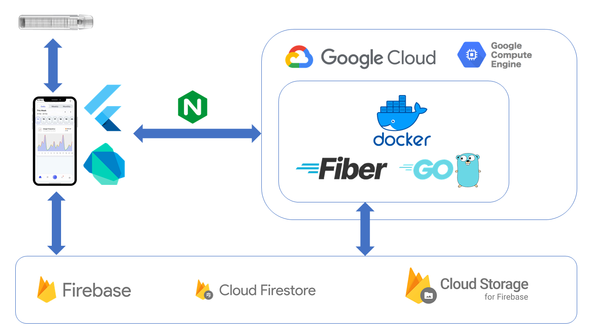

# Solution Challenge 2024 - Golang Server

## Architecture



## Technologies

Database: Firebase, Firestore, Firebase Authentication

API Deployment: Golang

Server Deployment: Docker, GCP Compute Engine - Golang Instance, NGiNX

## Instruction

0. Put the private files into folder foodfeed_app (.env and .json files)

1. Install the dependencies (The hardest one)

```
go mod download
```

2. Build the Docker image and run the container using the following commands:

```
  docker build -t app .
  docker run -d -p 3000:3000 app
```

  TODO: Use Docker-compose to automate deployment

5. *(Optional - Should use when running on a server)* Deploy Backend on **ngrok**

- Open a new terminal and run **ngrok**:
  ```
    ngrok http 3000
  ```

- If not using **ngrok**, just use the localhost [http://127.0.0.1:3000/](http://127.0.0.1:3000/)

## API Access: must have user JWT, or denied access

### User info:

GET /

### Coupons (get active coupons, claim active coupons)

GET /coupons

POST /coupons/:id

### Challenges (get avail challenges, active challenges, join challenge)

GET /challenges

GET /challenges/active

POST /challenges/:id

### Timer (get, close current timer, create new timer, recommend goal)

GET /timer

PUT /timer

POST /timer/:duration

GET /timer/goal

GET /timer/firsttime

### Nicotine consumption (get usage in timeframe, add usage)

GET /nicotine/:duration

POST /nicotine/:value